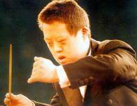

《舟舟和他的世界》

导演 张以庆

这是张以庆的三部曲之一，这部纪录片拍于1997年。说的是先天愚型症男孩舟舟的故事，充满了人文关怀。片中的舟舟有一个他的音乐世界，观众可以感受到这其中的美好。

但是到了片尾，导演又狠心地把观众打回到现实中来，其实舟舟自己的世界是怎样并不重要，重要的是我们的世界是怎样。

片中有一句话很精彩，&ldquo;人不能一辈子没人鼓掌&rdquo;！引发了我深深的思考。

片中也许有欢笑的时刻，但主旋律是悲伤的，我觉得，人，有时候傻并没有什么不好。

<iframe height=400 width=600 src='http://player.youku.com/embed/XNzk5NTU5MjQ=' frameborder=0 'allowfullscreen'></iframe>