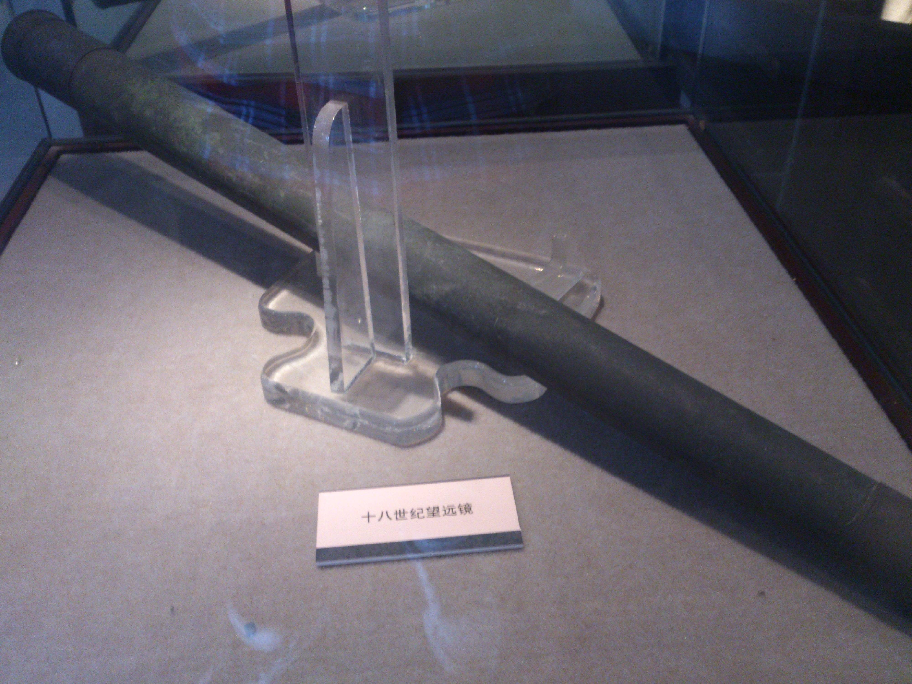
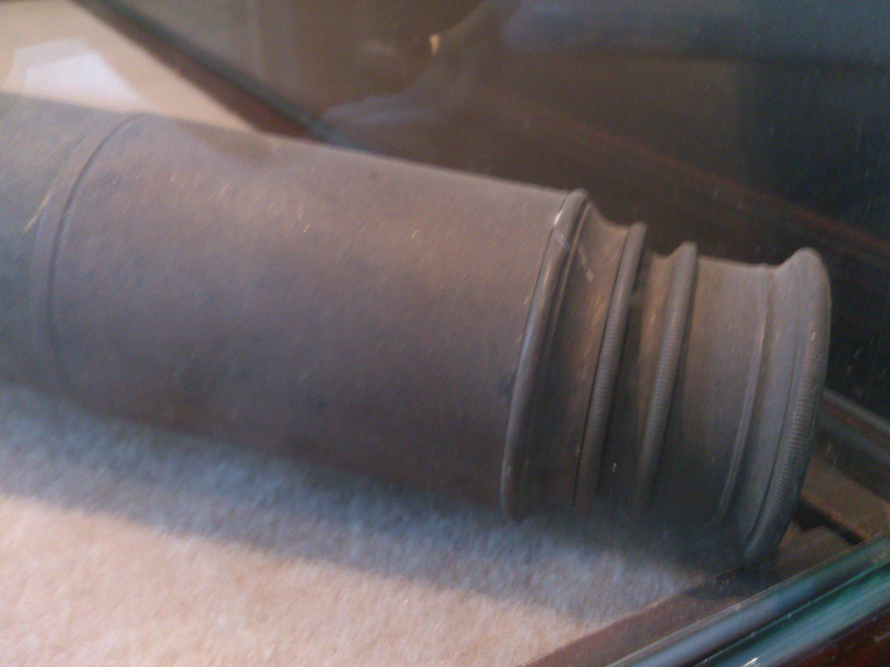
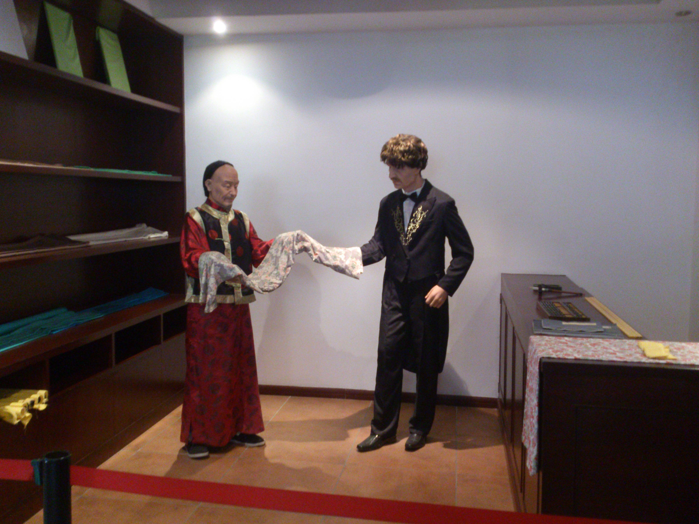
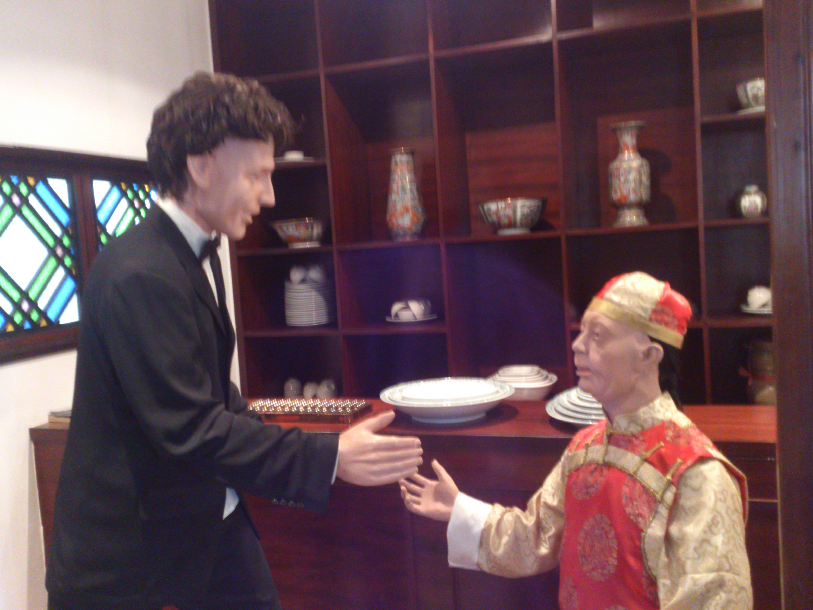
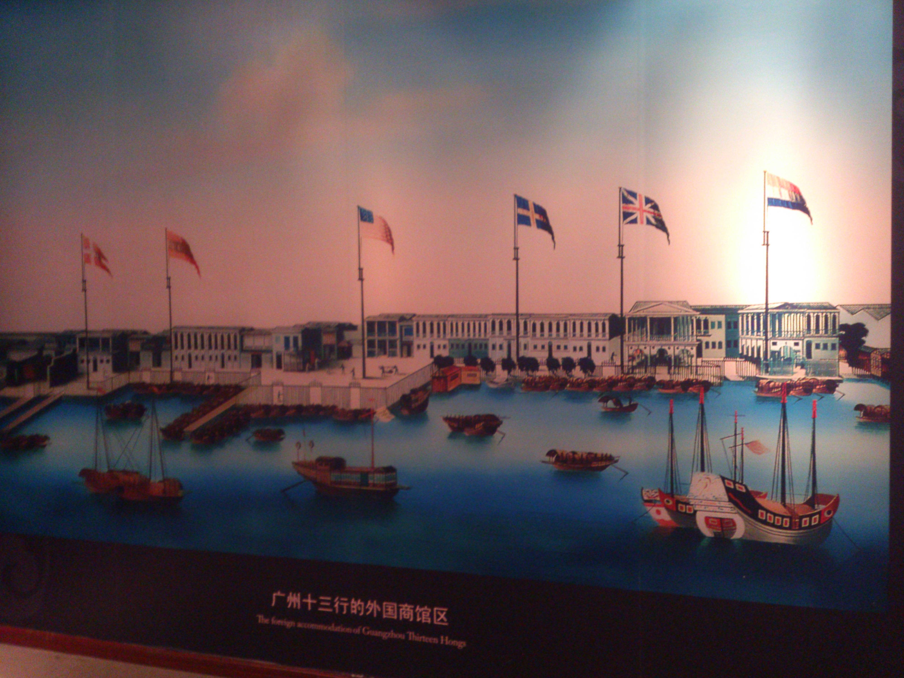
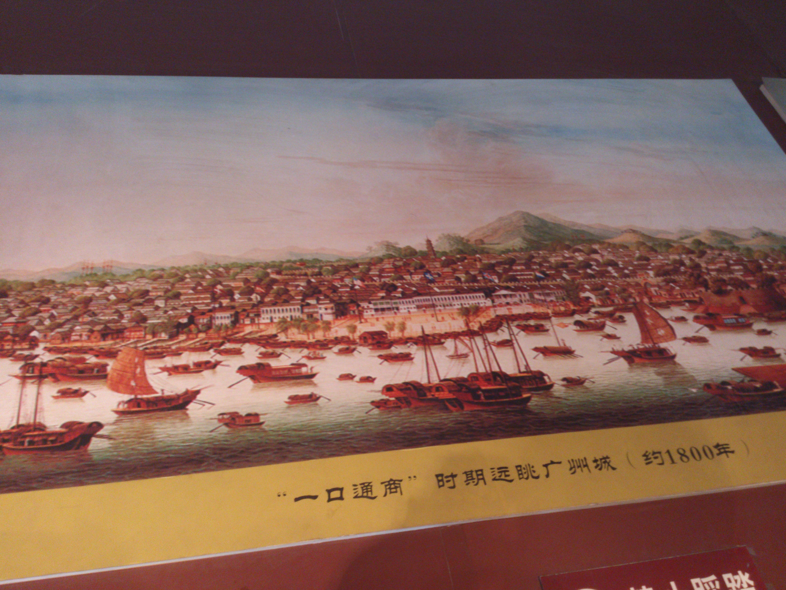
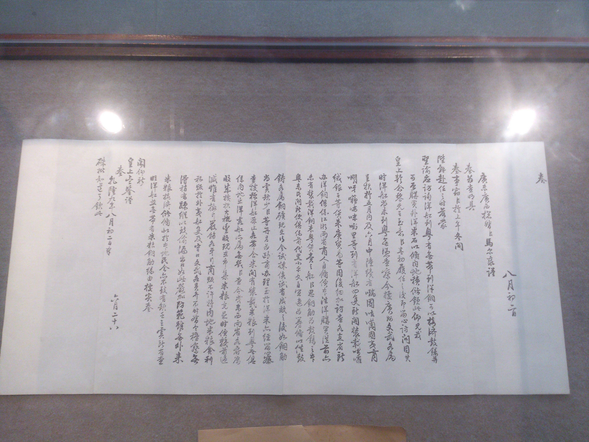
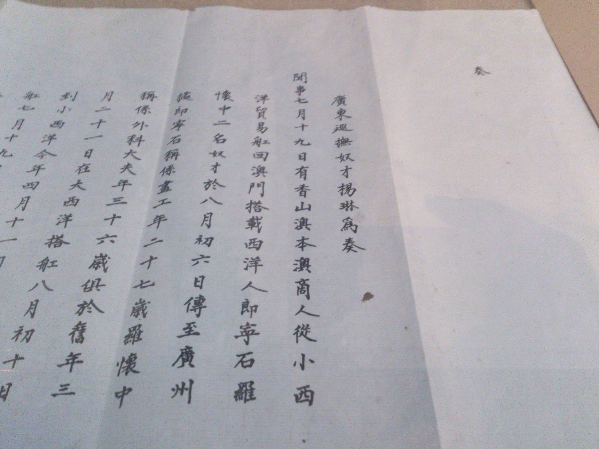
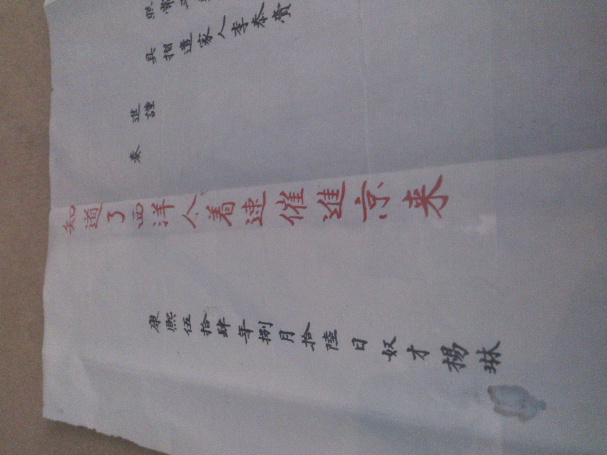
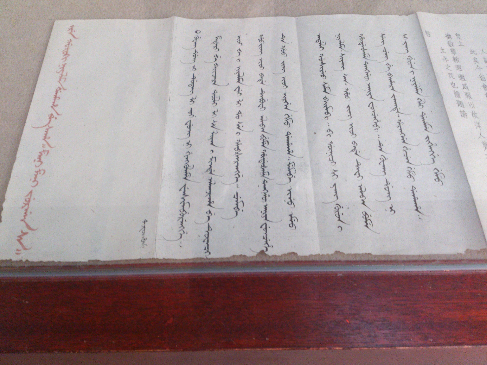

2月1日年初二，随家人一起去广州荔枝湾看水上花市，去看了十三行博物馆。

第一张照片是18世纪的望远镜，原来电影中的望远镜是这么长的，看尾部的螺旋，可能目镜处还能伸长！

然后印象深刻的就是奏折。里面有康熙、雍正、乾隆三朝的奏折，皇帝的字一直都不错，但风格明显不同，康熙的字正正方方、雍正的字像行楷、到了乾隆就有点潦草了。

从朱批可以看出当时的天朝的心态，“着西洋人进京来”。看来真是高高在上惯了，哪知日后被人侵凌得如此地步，当以为鉴。

但也看到皇帝对官员大段大段地教育，看来这皇帝当得还是用心的；不过我看过那么多的奏折之后深感，一个当权者，在远远的京城，每天只靠看文字的描述来治理天下，这怎么能行？！地方官员们怎么说当地就是怎么样，怪不得那么多冤假错案的发生。封建皇朝的制度是有如此大的弊端！

看完了博物馆，顺路去仁威祖庙拜拜神，香火很旺啊那里，而且也很灵愿！

这是在荔枝湾的文塔，形如毛笔状，代表文运，读书人前往转上几圈就会文昌星保佑，但是其实读书最重要的还是自己的勤奋和开动脑筋。