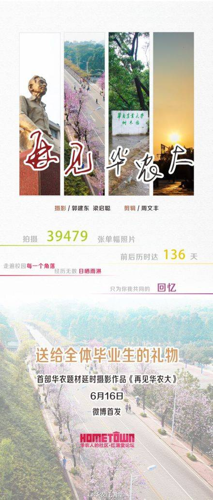
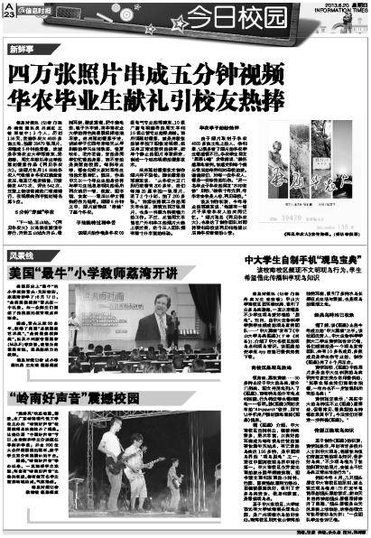
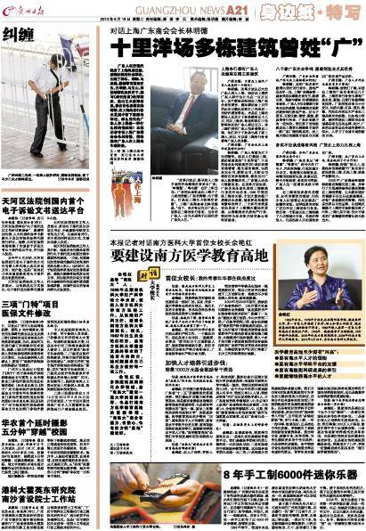

<iframe height=400 width=800 src='http://player.youku.com/embed/XNTc0MjMxOTMy' frameborder=0 'allowfullscreen'></iframe>

又是一年毕业季，又搬出这部经典延时摄影，确实真的很不错！其实这部作品发布于2013年，因为反响很不错，所以又被搬了出来。作者是我们学校的郭建东、梁启聪、周文丰师兄，现在应该已经毕业了吧。其实我想说，有机会的话，在华农还可以玩玩移轴，也是一个不错的选择。

当年的报纸也报道了&mdash;&mdash;

