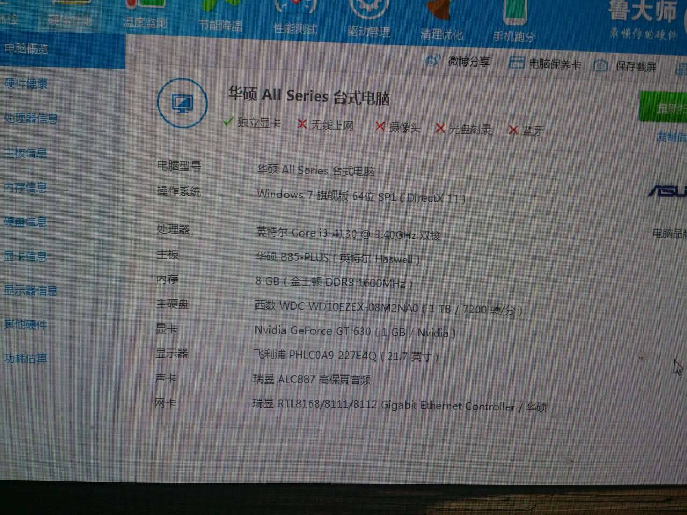
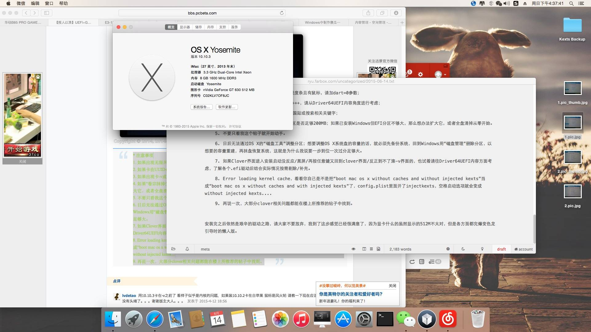

可能是最近折腾Docker的时候又用到了虚拟机，一下子激起了我的折腾兴趣；想实现黑苹果那么久，却一直害怕太难了，要爬贴子，但是我又不甘于一直只用win7，也许Mac OS真的能提高我的工作效率而不是一直用电脑打游戏。

首先肯定还是找黑苹果的资源以及教程，国内比较好的黑苹果网站有：

 - 威锋网 [http://bbs.feng.com](http://bbs.feng.com)
 - 远景 [http://bbs.pcbeta.com](http://bbs.pcbeta.com)

##我的配置

首先，循例要给出我的电脑的配置，如果大家看到你的配置跟我差不多，可以参考我的日志，相对吃起苹果来就会简单很多。

 - CPU 英特尔 Core i3-4130 @ 3.40GHz 双核
 - 主板 华硕 B85-Plus（英特尔 Haswell ）
 - 内存 8GB（金士顿 DDR3 1600MHz ）
 - 主硬盘 西数 WDC WD10EZEX-08M2NA0(1TB/7200转/分)
 - 显卡 Nvidia GeForce GT 630（1GB / Nvidia）
 - 声卡 瑞昱 ALC887 
 - 网卡 瑞昱 RTL8168/8111/8112 Gigabit Ethernet Controller
 
##Chameleon引导之路

所以我主要还是在这两个网站上找教程，一开始的时候，想着用Chameleon 变色龙来引导，因为变色龙相对来说比较傻瓜式，我所使用的教程有：

 - [[教程]Windows中制作傻瓜式安装 Yosemite黑苹果教程。看完你就懂了会了](http://bbs.pcbeta.com/forum.php?mod=viewthread&tid=1592675)
 - [[教程]Windows下使用变色龙r2378+ 引导 OS X 10.10 懒人版安装超详细完整图文通用教程](http://bbs.pcbeta.com/forum.php?mod=viewthread&tid=1518901)
 - [[下载] Yosemite 10.10 到 10.10.3 正式版 懒人版安装镜像 支持变色龙 Clover引导 支持虚拟机](http://bbs.pcbeta.com/forum.php?mod=viewthread&tid=1550906)
 
一开始我看了教程之后觉得很容易，真的就会了，但是结果完全没有没有我想的那么简单，首先我下载了镜像之后，用一个8G的U盘写好了启动盘，同时也用U大师[^1]写好了一个PE的U盘以备不时之需，然后我就开始安装了。

其中的过程可以参考上面的第一个教程，基本上傻瓜操作，没有什么问题。中间发生的一个小插曲就是我的鼠标突然之间动不了了，选择不了安装界面的菜单，一开始我以为是我买的鼠标不够好驱动不了，于是借了同学的鼠标试了之后才发现，都是不行，原来是我一直把鼠标和键盘插在USB3.0的USB口上，在安装黑苹果时，很多时候都是驱动不了USB3.0的，这时只要换个USB口插上就行了。

但是安装完之后才发现，原来黑苹果根本就不是安装之路而是驱动之路啊！首先，安装完之后，要先装上各种驱动，而这些驱动你要去找适应的版本，大家在安装黑苹果之前最好找到自己相对应的主板，这样相对会简单很多，我在文章开头已经给出了我的配置。

虽然变色龙引导却是相对傻瓜式很多，但是让我最不满意的地方就是，安装完之后的黑苹果就跟虚拟机里面一样，并不能设置为全屏（1920x1080），也就是说我的显卡驱动还是有问题；我的显卡是GT630，在网上查找说只是免驱的，而变色龙引导并不能识别我的独显，而英伟达提供的Web Driver驱动安装文件没有GT630这个版本；并且我的显示器使用的是HDMI线，是接在独显上面而不是主板上面的，这样一来，要不我放弃独显而使用核显同时把显示器的线接到主板上，要不我就找到显卡的驱动。

而我是不能接受浪费我的独显的做法的，所以我只能放弃变色龙，转用Clover四叶草引导了。

##Clover四叶草引导之路

其实Clover引导相对变色龙来说，确实是进步了许多，我看看了贴子的时间，在一两年前，那时候还是变色龙为主导的，而Clover可能刚出现，所以并不流行，而且也不怎么好用；但是看回一年以内的贴子，基本上大家都在用Clover引导了，这一方面是因为Clover的发展进步，一方面是Clover能引导白苹果，安装原版镜像，安装出来的黑苹果也跟白苹果相差之处很小，而最后一方面就是原版镜像需要安装在GPT分区格式的硬盘上，而Win7时32位是不支持GPT的，但是这么几年过去了，大家都有条件安装Win8甚至是Win10了，Win8安装是要在GPT分区上的，所以一般用Win8和Mac双系统的都喜欢使用Clover引导，而网站上的教程现在都是Clover居多了。

这样子我就更加坚定使用Clover引导了，首先我列出我所参考的教程：

 - [[教程] 在Windows中制作Clover引导的OS X 10.8.5/10.9.4/Yosemite 原版安装U盘，太简单了！](http://bbs.pcbeta.com/forum.php?mod=viewthread&tid=1554404)
 - [[交流] 华硕B85 PRO GAME 奔走在完美的路上（升级到10.10.3完全正常）](http://bbs.pcbeta.com/forum.php?mod=viewthread&tid=1589655)
 - [E3-1230 V3+B85M-DS3H+UEFI  Yosemite完美之旅](http://bbs.pcbeta.com/forum.php?mod=viewthread&tid=1579577)
 - [【授人以渔】UEFI+GPT+Clover OS X Yosemite原版单、双系统双版教程(正式版)](http://bbs.pcbeta.com/forum.php?mod=viewthread&tid=1542110)
 
前面我说，找到一个跟自己主板一样或者相似的配置很重要，这里就体现出来了，本来Clover的入门会比较困难，但是我找到跟我相似配置的帖子，所以就简单很多了，本来安装的时候我是进不去的，换了上面帖子提供的相似配置的config.plist后，就能成功安装了。

值得注意的是，安装原版镜像也是需要两段安装的，第一段安装最后一秒可能会很久，甚至要一个小时，请耐心等待[^2]，而第二段安装的时间相对会短一点，也请要耐心，一定要耐心，一定要耐心，重要的事情说三遍。

>注意事项

>    1. 如果出现无限风火轮/卡在第二阶段进度条且有鼠标，请加dart=0参数；

>    2. 如果卡在UUID+++++++++++++++++++，请从Driver64UEFI内容角度进行考虑；

>    3. 如果出现卡-v或自动重启，请查看五国贴或搜索相关关键字；

>    4. 如果“卷宗抹掉失败”，请考虑EFI分区是否足够200MB；如果已安装Windows但EFI分区不够大，那么想办法扩大它，或者全盘清掉从零开始。

>    5. 不要只看我这个帖子就开始动手。

>    6. 日后无法通过OS X的“磁盘工具”调整分区；想要调整OS X系统盘的容量的话，就必须先备份系统，回到Windows用“磁盘管理”删除分区，以想要的容量重建，再抹盘恢复系统，这就是为什么我说要一步到位一次过分足够大。

>    7. 如果Clover界面进入安装启动没反应/黑屏/再按任意键又回到clover界面/反正到不了滚-v界面的，也试着请往Driver64UEFI内容方面考虑，了解各个.efi驱动后结合实际情况按需剔除/补充。

>    8. Error loading kernel cache，看看你自己是不是把“boot mac os x without caches and without injected kexts”当成“boot mac os x without caches and with injected kexts”了，config.plist里面开了injectkexts，空格启动选项就会变成without injected kexts....

>    9. 再说一次，大部分clover相关问题都能在楼上所推荐的帖子中找到。
    
安装完之后依然是艰辛的驱动之路，请大家不要放弃，我到了这步感觉已经很满意了，因为显卡CPU显示什么的不太对，但是各方面都完爆变色龙引导时的懒人版。

##引导之路

由于我之前安装的Win7 64位是在MBR格式的分区上的，所以将整个硬盘的分区表转为GPT后，原来的Win7不能引导开机，在网上有一些讨论的帖子教程，不少人表示能成功修复，无损转换，无非都是将BOOT文件放进新建的EFI/Microsoft里面，然后修复BCD，但是我没有成功实现，大家需要可以看看。

 - [mbr怎么转gpt保留系统](http://bbs.pcbeta.com/forum.php?mod=viewthread&tid=1520131)
 - [Clover引导GPT分区Win8+Mavericks 10.9.3](http://bbs.pcbeta.com/forum.php?mod=viewthread&tid=1514707)

如果是双硬盘的同学那就更容易解决了，可以自行找更简单的教程。说一下我的解决方法，还是直接重装Win7比较快捷，一定是要Win764位的，但是C盘的内容会丢失，而我打算以后主要使用Mac，Win7都是给宿友打游戏才装回的，所以也就问题不大了。

另外，大家要注意的时，安装时我们是用U盘来启动引导的，所以安装完后我们要划一个200M左右的EFI分区，用作以后直接用硬盘来引导开机。具体做法看回这个教程[【授人以渔】UEFI+GPT+Clover OS X Yosemite原版单、双系统双版教程(正式版)](http://bbs.pcbeta.com/forum.php?mod=viewthread&tid=1542110)，这个教程可以作为重点参考的教程，写得非常详细非常好。

##小米随身WIFI的驱动和黑苹果连接WIFI

因为小米随身WIFI的官网上并没有提供Mac版本，而我们黑苹果一般是没有带无线网卡的，所以我要把在Win7下能用的小米WIFI在苹果下也能用，但是到最后也只能实现连接WIFI，而不能共享WIFI，不过也比较正常啦，结果还是能接受的。PS：这里的解决方法小度、360WIFI等都能适用。

首先，要查看小米随身WIFI的配置信息，看看是不是跟我一样

其中的产品ID和厂商ID就是所说的PID和VID。可以参考这个教程[小米随身wifi for mac版详细使用图文步骤](http://www.jb51.net/softjc/180602.html)和[小米WIFI MAC驱动，支持10.8/10.9/10.10](http://bbs.pcbeta.com/forum.php?mod=viewthread&tid=1529169)，注意，替换的info.plist一定要把PID和VID修改对应的十进制数字才有效。

如果你按照上面的教程设置后，还是不能用，这里提供能用的DWA-125安装程序，一般重新安装后就能用了。

DWA-125.pkg[^3]

同时也备份了所需要的各个文件，可以下载

wififormac(jb51.net).rar[^4]

##总结

至此，我的黑苹果之路可说已经进行到不错的一段了，反正就是生命不息，折腾不止，谢谢各位看官。

[^1]: 或者你可以使用大白菜或者深度的PE
[^2]: 现在也许你听不懂，但是到时候你在等的时候就能体会到了，建议你准备好电影，我当时就是看了几部这星期更新的美剧才等完的。
[^3]: [DWA-125.pkg](./images/DWA-125-2.pkg.zip)
[^4]: [wififormac(jb51.net).rar](./images/wififormac(jb51.net).zip)