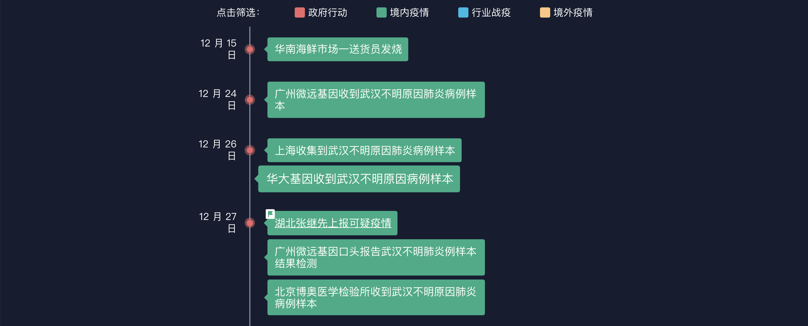
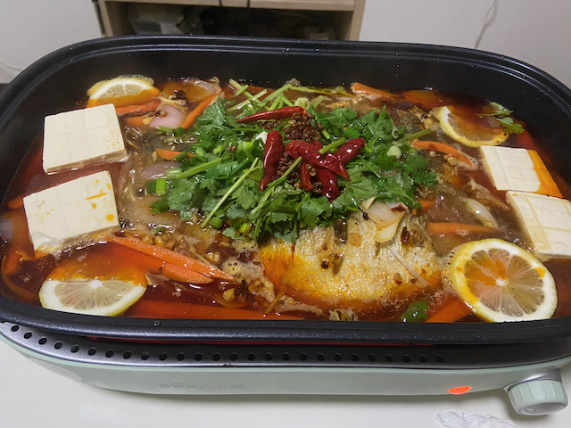
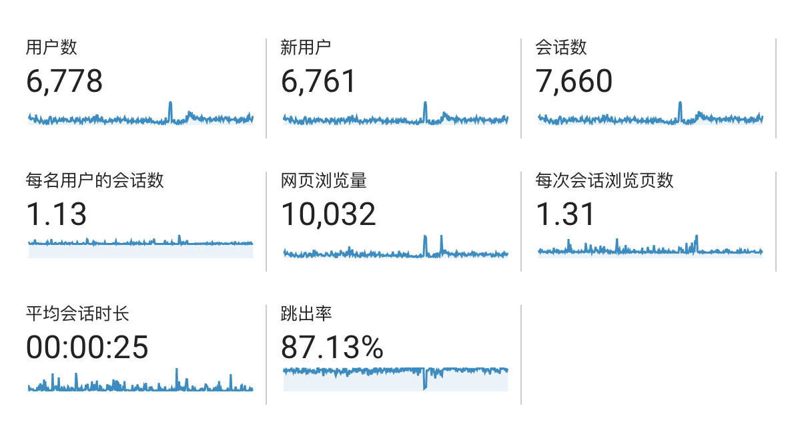
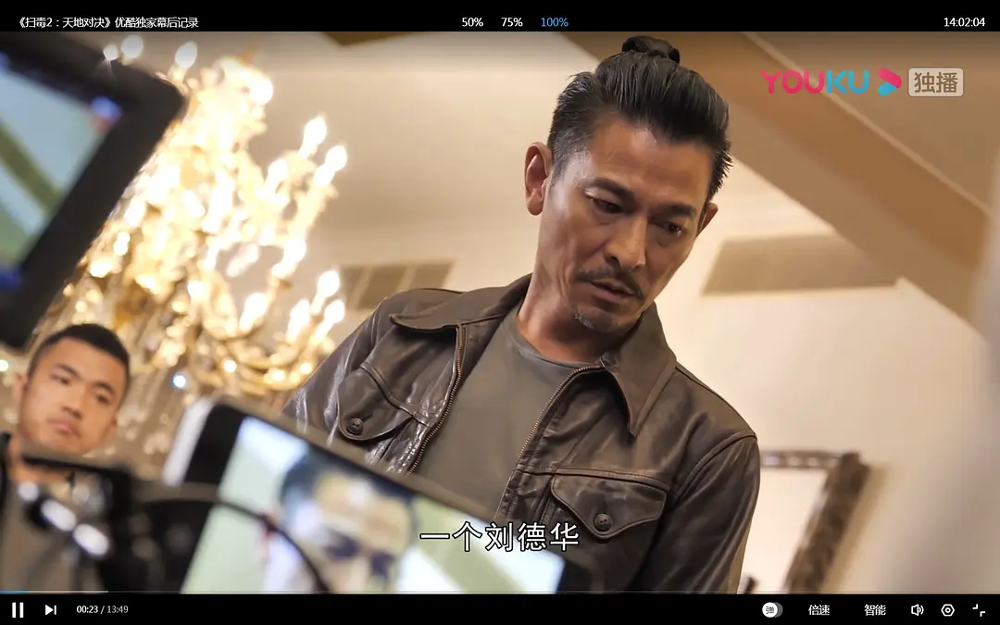

> 与上述信息同样高度契合的，是微信公号 “小山狗” 1 月 28 日曾发布过的一篇题为 “记录一下首次发现新型冠状病毒的经历” 的文章。作者在留言区自称就职于位于广州黄埔的一家民营企业，文中记录：“2019 年 12 月 26 日刚上班，还是如往常一样先大概浏览一下这一天的 mNGS 病原微生物自动解读结果。意外的是，发现有一个样本报出了敏感病原体 ——SARS 冠状病毒，有几十条的序列，且这个样本只有这么一个有意义的病原体。心头一紧，赶紧后台查看详细的分析数据，发现相似度并不算很高，只有大约 94.5%。为了确认结果的可靠性，开始了详细分析。探索版的分析结果提示这个病原体跟 Bat SARS like coronavirus（蝙蝠类 SARS 冠状病毒）最相似，整体相似度在 87% 左右，而跟 SARS 的相似度是约 81%。”
>
> ——《财新 | 独家 | 新冠病毒基因测序溯源：警报是何时拉响的》

今年年初时小山狗的那篇文章在群里转发开来，一方面，我惊讶于他们的速度（24日收到样品，27日口头报告新冠病毒，而到了30日，已经有3家公司报告了这个病毒）；另一方面，我对于自己工作于生物这个行业而感到荣幸，虽不如这些大佬那么牛逼，但是无论是从事肿瘤药物检测、遗传病，还是病原体检测等，生物行业对群众都是有用的，而且生物行业的成熟，检测到病毒，短时间内就组装好了病毒序列，分享给全世界（参考[科技爱好者周刊（第 139 期）：生物学的可怕进展](http://www.ruanyifeng.com/blog/2020/12/weekly-issue-139.html)这一期的本周话题），以及后来的检测试剂盒开发，我认为在这一次疫情中，生物行业的反应速度和表现，可以说满分不为过。

## 工作

有一个之前听说过的故事，最近又听了一次，对我有些触动：

> 有一个人问一个得道的老和尚：“得道前干啥？”老和尚说：“挑水、扫地、做饭。”这个人又问得道后呢。回答依然是挑水、扫地、做饭。那人又问区别在哪里。老和尚回答说：“不得道前挑水时想着扫地，扫地时想着做饭。现在挑水时想着挑水，扫地时想着扫地，做饭时想着做饭。”

有时候我们工作久了，想达到的目标就多，所以我们工作时就会做着这件事情时就想着下一件，比如做着RNA分析时，就想着要是我去学机器学习，将一些机器学习的方法应用到分析中，是不是能达到更好的效果。

而且我们做生信分析时，有时候就是要等程序运行完，才能得到结果，而等结果这段时间，又想着给自己安排一些其他工作，结果边做着其他工作，边时不时看看程序跑完没有，最后就是三心两意。

所以工作越久，越觉得自己专注力不行，效率下降。看到这个故事之后，我忽然明白，心里装的事情越多，越不可能把当前的事情做好。

## 学习

今年在看了一些别人的源码后，突然理解一个包/项目应该是怎么写的，感觉Python的水平提高了不少（只是自我感觉良好哈哈哈）；然后今年由于项目要用到R，终于在自己默默学习了R很久之后，会写一些R脚本了，果然实践是检验真理的唯一标准。

不过由于搬家后是地铁通勤，所以没有再像以前一样，上班途中看视频学习，略有遗憾。

今年终于报考驾考了，目前进度是科目一。。。

## 消费

- 跟着mjj，屯了几台vps，自己搭了TTRSS，非常好用，之前想搞Emby/Jellyfin之类，最终放弃了
- 给自己换了iPhone 11，给女友换了12
- 投影仪（女朋友先斩后奏送的礼物）
- 健身环大冒险、动森，还有疫情在家时，买了很多switch卡带玩，比如巫师3，路易基鬼屋等，强烈推荐鬼屋，女友通关后又将所有宝石收集完
- 小熊料理锅，自己在家烤肉/烤鱼，搬家后还请爸妈来吃了一顿烤肉，二老也很喜欢这个锅

## 输出

我在语雀上建了个[“好物分享”](https://www.yuque.com/ryuz/shares)的知识库，用来分享自己觉得好的、值得分享的网站、软件等，特别是在分享轻芒杂志的邀请码后，竟然有很多朋友使用了我的邀请链接，所以分享还是有价值的；来年我会继续更新。

今年也参与了思考问题的熊举办的“[素材学习分享周刊](https://kaopubear.top/blog/2020-01-19-refgroup2020/)”小组，贡献了自己的一期，也收获了很多大佬分享的干货。

生活里很多内容都是在工作中学习到的，但由于工作内容保密的原因，之前很多想写的博客都没有动手，拖的时间久了，自然就觉得可写可不写了；但今年把语雀当作自己的wiki后，确实很方便，一些工作上遇到的问题，可以及时地记录下来，由于是私人wiki，也不用像博客一样要原创才行，大胆地摘录下别人的方法就好；而且过一段时间后，如果有价值，还可以修改修改，放到博客上。

今年博客只更新了4篇博客，慢慢地我也不强求自己每年更新多少篇，只希望自己之后有更多有价值的想法和经验可以分享给大家。今年没有参加到farbox 2.0的内测，然后自己抄了spencerwoo的博客，搬到Vercel上用Gridsome来生成。

## 生活

今年又搬了一次家，年初的时候，由于疫情的关系，所住的城中村管得比较严，想要回去，便要在村口的关卡，找本地房东来签责任书，但我租的是二手房东那种公寓，二手房东也在外省回不来，本地一手房东也不愿意出面来担责，而我当时已经拿着行李回到村口了，那些工作人员根本不理会任何解释，只会机械重复地说，让房东出来接你回去；类似的情形，大家在年初返京的新闻同样可以了解到；

正是这种政策，城中村让我觉得毫无人权，所以今年我搬家的时候，就选择了住宅小区，同时也满足了自己想要一个有飘窗的卧室和屋子有个阳台的心愿。但是房租也涨了2倍，而且物价水平也比以前在城中村里高。

今年由于把mbp拿到公司了，所以就用女友的旧笔记本的内存+SSD，捡垃圾组了一台戴9020m的小主机，加上网卡，花了700块钱左右，装上黑苹果，用起来也很舒服；特别是有时候拿去插在投影仪和电视上，当个没广告的电视盒子，因为小机箱，所以特别轻。

今年看到了《扫毒2》里刘德华的发型，很喜欢那种辫子发型，突发奇想留了一段时间长头发，留的过程自然度过一段时间的尴尬期。但是最近又剪掉了，当然是因为我不够帅，而且留这种发型的人忽然多了起来，就一点都不个性了。

最后是今年的一点小感悟：

1. 没有什么是永久的，做好准备，拥抱变化
2. 适合自己的才是最好的
3. 勿忘本心

## 2021

明年的目标，

- 都买健身环了，当然是减肥、减肥再减肥
- 早日写出自己想要做的那个软件
- 顺利拿到驾照

最后，祝大家新年快乐，心想事成！