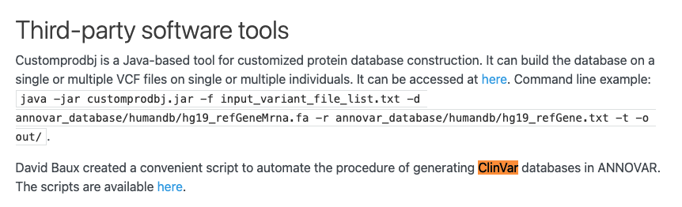
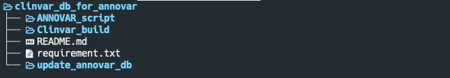
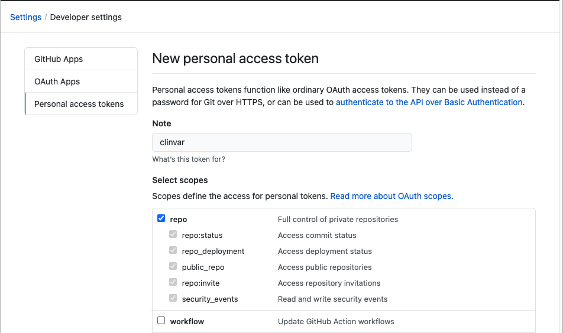
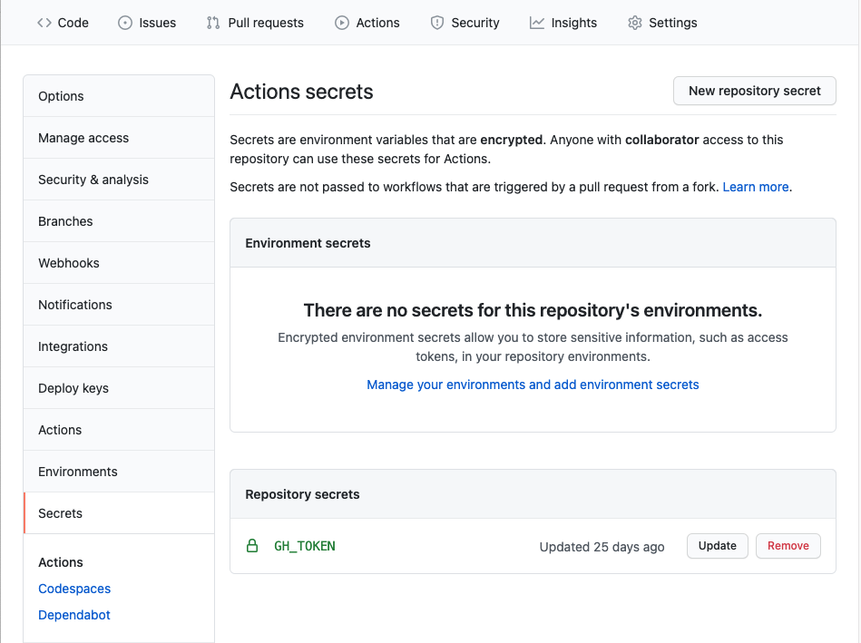
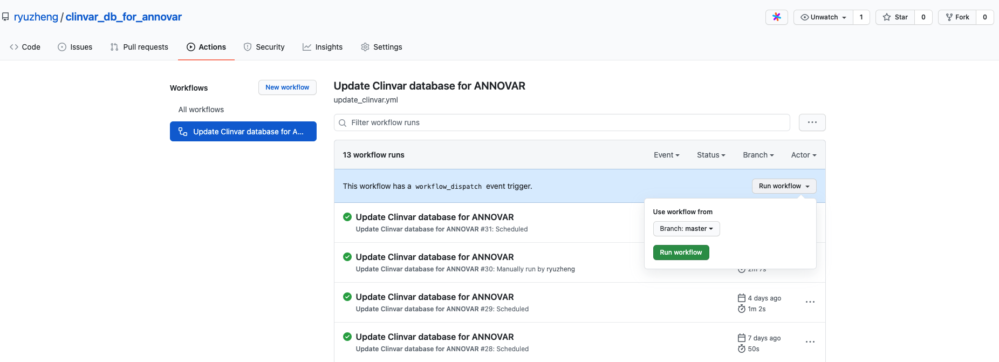
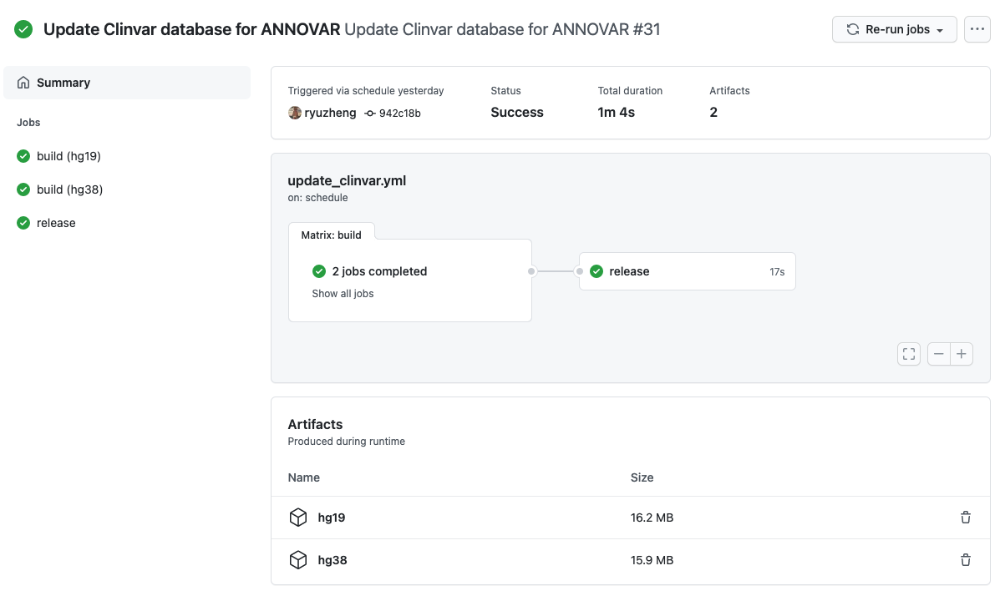
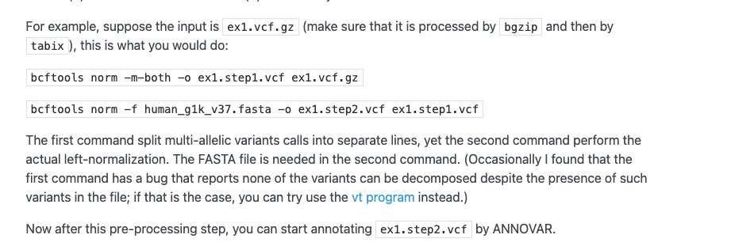
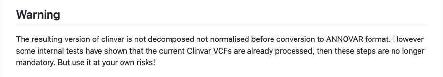

前段时间，看到ANNOVAR在文档里更新了一个可以自行更新Clinvar数据库的脚本，ANNOVAR更新Clinvar的频率，一般是半年到一年才更新一次。




恰好又看到Github新推出了[“Flat Data”](https://octo.github.com/projects/flat-data)，就想着是不是能够像Flat Data一样，抓取Clinvar数据库，然后定期更新成ANNOVAR数据库；可惜研究了一圈，Flat Data的示例都是使用JavaScript或者Typescript脚本的。
​

此路不通，那就换一条路，使用[David Baux的脚本](https://github.com/mobidic/update_annovar_db)和Github Actions来实现以下目的：
​

1. 定时从NCBI抓取Clinvar的VCF更新（Github在国外，下载快）；
2. 转换成ANNOVAR的数据库文件（省却下载到服务器再处理的步骤）；
3. 发布到Github repo和打包成release，使用CDN加速下载


正好Clinvar的数据库压缩后的文件为15Mb左右，不会超过大小限制；其他ANNOVAR的数据库，也可以使用相同的实现方法。
​

## 建立Github repo


首先我们建立一个repo，如[ryuzheng/clinvar_db_for_annovar](https://github.com/ryuzheng/clinvar_db_for_annovar)，主要存放生成的Clinvar数据库文件、release和Github Actions脚本；
​

然后为了整洁，我另外建立2个repo，分别存放

- 需要用到的ANNOVAR脚本，如`ryuzheng/ANNOVAR_script`，版权问题，设置为私有repo，请自行到ANNOVAR官网下载
   - `convert2annovar.pl`
   - `index_annovar.pl`
- 修改过的脚本，如[ryuzheng/update_annovar_db](https://github.com/ryuzheng/update_annovar_db)，修改为下载weekly更新的VCF与其他一些更适合Github Actions的改动，这里不赘述


然后我们通过`submodule`，将这2个repo与原来的主repo连接起来，

```shell
# 进入主repo的文件夹
cd clinvar_db_for_annovar

# 注意这个repo是私有的，所以得用ssh的形式
git submodule add git@github.com:ryuzheng/ANNOVAR_script.git

# 这个repo是公开的，https和ssh的形式都可以
git submodule add https://github.com/ryuzheng/update_annovar_db.git、

# 后期如果更新了其中某个submodule的repo，需要更新链接的版本
git submodule update --remote
# 或者进入submodule的文件夹
cd update_annovar_db
git pull origin main
```

我们整个目录的结构如图



这样做的好处是，

- 主repo看起来很干净，只存放生成的文件，并且commit的记录也很干净；
- 后期如果需要更新代码，我们只需要单独修改submodule的链接，submodule项目的其他代码修改不会影响这个项目；
- 由于部分代码不能公开，submodule可以引入私有repo


## 编写Github Actions


我们在repo文件夹下建立`.github/workflows`文件夹，用来存放Github Actions的yml文件，Github会自动识别该文件夹下的yml文件。
​

在`.github/workflows`下新建一个`update_clinvar.yml`文件，内容如下：

```yaml
name: Update Clinvar database for ANNOVAR # 设置该action的名称

on:
  schedule:
    - cron: "0 0 */3 * *" # 由于Clinvar一周更新一次，这里设置为每3天一次
  workflow_dispatch: # 用于手动执行
```

然后我们先建立第一个任务（jobs），将这个任务命名为`build`，运行我们修改后脚本，将clinvar的VCF文件转换成ANNOVAR的数据库，并上传结果到artifacts，用于下一步。

```yaml
jobs:
  build:
    runs-on: ubuntu-latest
    strategy:
      matrix:
        genome: ["hg19", "hg38"] # 设置一个matrix，分别为hg19和hg38 2个基因组版本的任务

    steps:
      - uses: actions/checkout@v2
        with:
          token: ${{ secrets.GH_TOKEN }}
          submodules: "true"

      - name: Set up Python 3.9 # 使用python 3
        uses: actions/setup-python@v1
        with:
          python-version: 3.9

      - name: Install dependencies # 安装依赖
        run: |
          python -m pip install --upgrade pip
          pip install -r requirement.txt
          
      - name: Update Clinvar with GRCh37 # hg19的clinvar文件处理
        if: matrix.genome == 'hg19'
        run: |
          cd ./update_annovar_db
          python3 ./update_resources.py -d clinvar -w -hp ../Clinvar_build/hg19 -a ../ANNOVAR_script -g GRCh37
          
      - name: Update Clinvar with GRCh38 # hg38的clinvar文件处理
        if: matrix.genome == 'hg38'
        run: |
          cd ./update_annovar_db
          python3 ./update_resources.py -d clinvar -w -hp ../Clinvar_build/hg38 -a ../ANNOVAR_script -g GRCh38
          
      - name: Upload artifacts # 上一步生成地址为Clinvar_build/hg*，上传文件成artifact
        uses: actions/upload-artifact@v2
        with:
          name: ${{ matrix.genome }}
          path: ./Clinvar_build/${{ matrix.genome }}
```

然后我们建立第二个任务，将这个任务命名为`release`，用于当clinvar更新时，存放我们更新后的文件，以及打包成release发布。

```yaml
  release:
    runs-on: ubuntu-latest
    needs: build # 需要上一步build执行成功后方能执行

    steps:
      - uses: actions/checkout@v2
        with:
          token: ${{ secrets.GH_TOKEN }}
      
      - name: clean previous build # 删除之前的版本
        run: |
          rm -f Clinvar_build/hg19/*
          rm -f Clinvar_build/hg38/*
          
      - name: Download artifacts for GRCh37 # 将hg19的artifact下载到指定路径
        uses: actions/download-artifact@v2
        with:
          name: "hg19"
          path: ./Clinvar_build/hg19

      - name: Download artifacts for GRCh38 # 将hg38的artifact下载到指定路径
        uses: actions/download-artifact@v2
        with:
          name: "hg38"
          path: ./Clinvar_build/hg38

      - name: Commit # 只有文件发生变动，才会commit
        id: auto-commit-action
        uses: stefanzweifel/git-auto-commit-action@v4

      - name: Push changes
        uses: ad-m/github-push-action@master
        with:
          github_token: ${{ secrets.GH_TOKEN }}
          branch: master

      - name: Get current date # 获取当前日期，作为release的版本
        id: date
        run: echo "::set-output name=date::$(date +'%Y-%m-%d')"

      - name: Create Github Release # 只有新的commit，才打包发布新版本
        if: steps.auto-commit-action.outputs.changes_detected == 'true'
        uses: actions/create-release@v1
        id: create_release
        with:
          tag_name: tag-${{ steps.date.outputs.date }}
          release_name: release-${{ steps.date.outputs.date }}
        env:
          GITHUB_TOKEN: ${{ secrets.GH_TOKEN }}

      - name: Upload assets to Github Release # 将生成文件上传到release的asset
        if: steps.auto-commit-action.outputs.changes_detected == 'true'
        uses: csexton/release-asset-action@v2
        with:
          pattern: "Clinvar_build/*/*.gz"
          github-token: ${{ secrets.GH_TOKEN }}
          release-url: ${{ steps.create_release.outputs.upload_url }}
```

完整的yml文件请查看[update_clinvar.yml](https://github.com/ryuzheng/clinvar_db_for_annovar/blob/master/.github/workflows/update_clinvar.yml)。
​
## 配置Github token
​

在上一步的yml文件里，相信大家多次看到类似`github_token: ${{ secrets.GH_TOKEN }}`这样的配置，这是因为Github在执行诸如commit、checkout、push等git操作时，都需要权限，因此我们需要配置一个token。而这个token，我们放在secrets里，别人是无法看到的。
​
打开[Personal access tokens](https://github.com/settings/tokens)，点击右上角的**Generate new token**，输入一个名字用于识别，然后勾选上repo的框（允许repo的操作，视乎你所需的权限），然后点击**Generate token**，将生成的token复制好。




再打开你的repo的Settings选项卡，然后选择Secrets该项，点击右上角的**New repository secret**，填入名称，如`GH_TOKEN`，这个名称要与yml里的`${{ secrets.GH_TOKEN }}`相同，然后将刚才复制好的token填入下面的value里。



这样我们就配置好了token；如果大家有其他密钥或者需要保密的内容，也可以设置在secrets里。
​

## 运行Github Actions
我们点击repo的Actions选项卡进入该repo的Actions，第一次进去，可能会提示**Get started with GitHub Actions**，我们点击“Skip this and set up a workflow yourself”就行。
​

然后我们在All workflows下会看到我们刚才命名为`Update Clinvar database for ANNOVAR`的action，点击进入，点击右边的run workflow就可以手动执行。



如果执行成功，我们可以看到不同的jobs运行结果以及生成的artifacts。



## CDN加速下载

打开[https://github.com/ryuzheng/clinvar_db_for_annovar/releases/latest](https://github.com/ryuzheng/clinvar_db_for_annovar/releases/latest)，就能看到最新的release，我们可以[FastGit](https://doc.fastgit.org/zh-cn/guide.html#release-%E5%92%8C%E6%BA%90%E7%A0%81%E5%AD%98%E6%A1%A3%E7%9A%84%E4%B8%8B%E8%BD%BD)或者[jsDelivr](https://www.jsdelivr.com/features#gh)来作为CDN，示例如下

```shell
# Release
# 假设下载链接为https://github.com/ryuzheng/clinvar_db_for_annovar/releases/download/tag-2021-05-21/hg19_clinvar_20210517.txt.gz
wget https://download.fastgit.org/ryuzheng/clinvar_db_for_annovar/releases/download/tag-2021-05-21/hg19_clinvar_20210517.txt.gz

# 假设文件位置为Clinvar_build/hg38/hg38_clinvar_20210517.txt.gz
wget https://cdn.jsdelivr.net/gh/ryuzheng/clinvar_db_for_annovar/Clinvar_build/hg38/hg38_clinvar_20210517.txt.gz
```

至此，我们的目的已经达成，如无意外，Github Actions会每3天去抓取Clinvar最新的VCF文件，并转换成ANNOVAR的文件形式。
​

## 一个小讨论

ANNOVAR在进行VCF注释之前，需要先对VCF文件进行split以及left-normalization（详见[VCF Processing Guide](https://annovar.openbioinformatics.org/en/latest/articles/VCF/)），因为ANNOVAR的注释文件，都是left-normalization的。



**那么Clinvar的VCF文件，是否需要进行split和left-normalization，然后再转换成ANNOVAR的注释文件？**这个问题[David Baux也提到了](https://github.com/mobidic/update_annovar_db)。



我对Clinvar的VCF文件进行了测试，发现它已经是split和left-normalization的了。由此验证了我以前看过某篇博客，上面说Clinvar的突变描述格式，在染色体层面，是left-normalization，而在cDNA注释和氨基酸注释上，则遵循HGVS的标准。这或许能作为我们处理突变描述格式时的一个参考。
​

截止该篇博客发布，[这个repo](https://github.com/ryuzheng/clinvar_db_for_annovar)已经运行了将近一个月，目前已经较为稳定，欢迎大家使用。